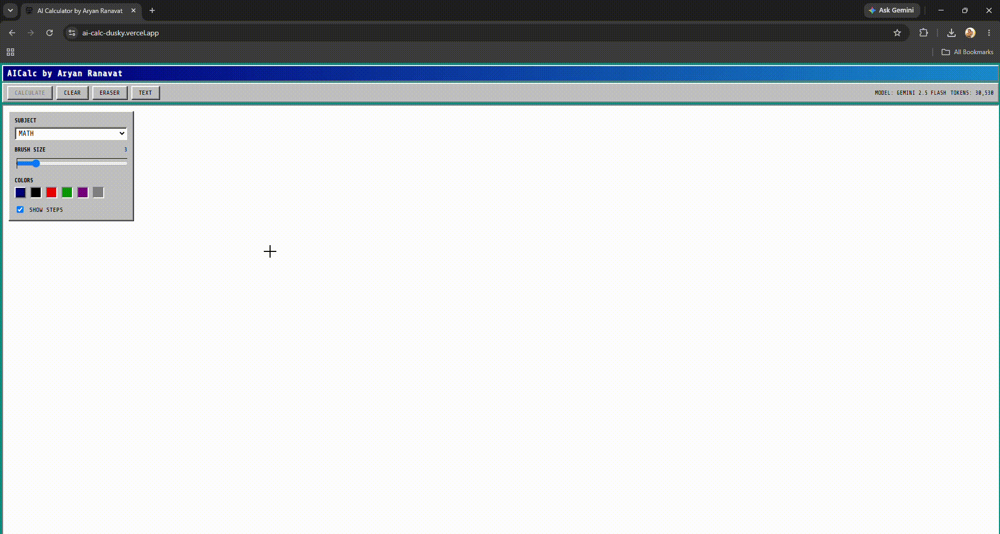
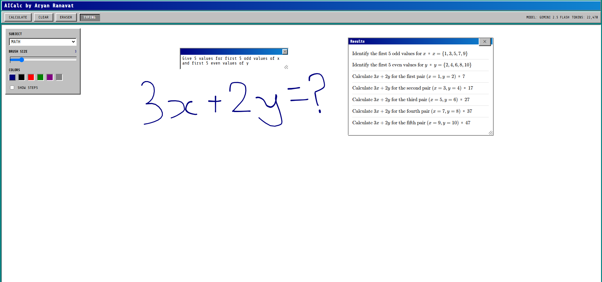
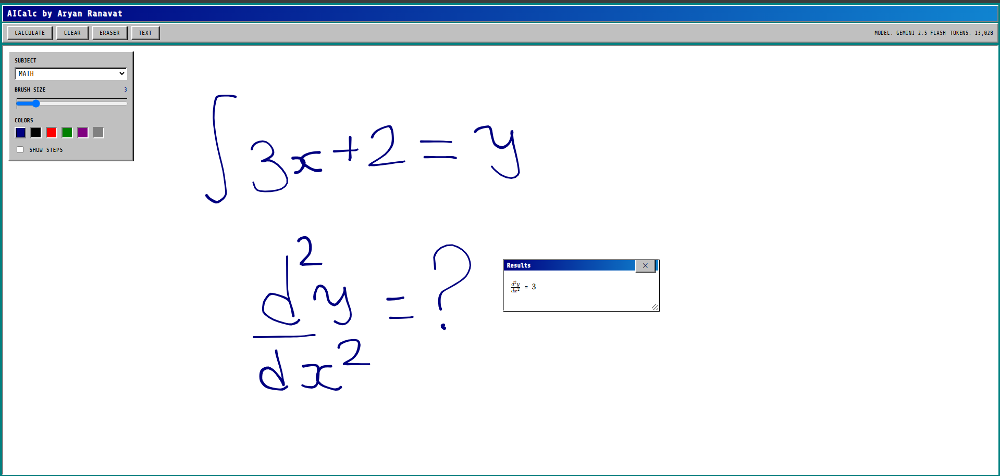
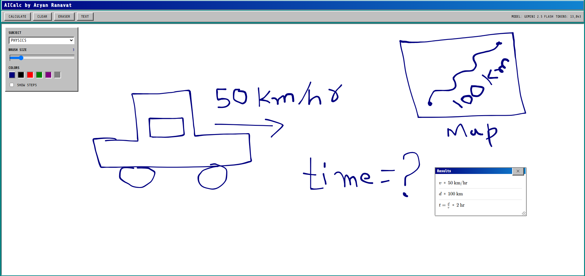
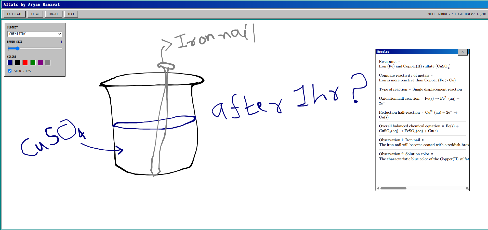
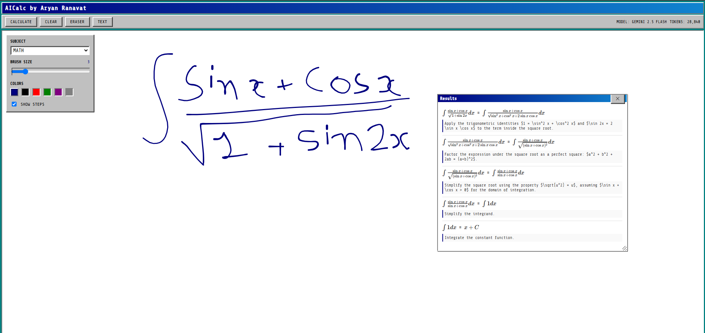

<div align="center">
  
  ##  AICalc - Inspired By IPad Calculator for Mutli-Platforms

  **Draw math, physics, or chemistry problems and get instant AI solutions.**

  [](#)
  [](#)
  [](#)
  [](#)
  [](#)

  **[Live Demo](https://ai-calc-dusky.vercel.app)** | **[Backend Health](https://aicalc-nvif.onrender.com/healthz)**

</div>

---

##  Overview

**AICalc** is a highly interactive, web application that bridges the gap between hand-written equations and structured AI computation. Users can draw problems onto a digital canvas, and the system leverages Google's **Gemini 2.5 Flash** vision model to extract, solve, and render the results seamlessly back to the UI in Latex Format.

---

##  See It In Action
<div align="center">
  
</div>

---

##  Features

###  Canvas & User Experience
- **Smooth Freehand Drawing:** Utilizes `perfect-freehand` with a custom Catmull-Rom-style interpolation. It calculates pressure curves dynamically so handwriting looks natural and legible.
- **Drag & Drop Text Mode:** Don't want to draw? Add text boxes! You can drag them by the header, resize them from the corner, delete them, and place them anywhere on the canvas.
  <div align="center"><br/><br/><br/></div>
- **Draggable Results Window:** The solution card isn't static. You can drag and resize it around the screen so it doesn't block your drawing.
- **Tooling Suite:** Adjustable brush sizes (1-15), 6 curated colors, and a dedicated Eraser mode.
- **KaTeX Integration:** All mathematical results are rendered natively with `react-katex` for crisp, textbook-quality formatting.
- **Windows 95 Aesthetic:** A nostalgic UI with properly styled buttons, borders, and visual feedback that adapts perfectly to mobile screens (bottom drawer controls).

###  AI & Backend Logic
- **Subject-Specific Prompts:** Select between Math, Physics, or Chemistry. The backend alters the system prompt to enforce domain-specific strictness.
  <div align="center"><br/><br/><br/>
  <br/><br/><br/>
  <br/><br/><br/></div>
- **Step-by-Step Breakdowns:** Toggle the "Show Steps" feature. When enabled, the AI returns a JSON array of step-by-step explanations, parsed and rendered sequentially on the frontend.
  <div align="center"><br/><br/><br/></div>
- **Text-to-Canvas Baking:** Before sending the request to the AI, all DOM-based text boxes are strictly formatted and drawn (baked) directly onto the pixel raster to ensure the Vision model sees exactly what the user sees.

###  Performance & Cost Optimizations
- **Smart Blank-Canvas Detection:** The frontend samples every 40th pixel on the canvas. If the ink threshold isn't met, it blocks the API call. *Saves money by preventing empty queries.*
- **Pre-Flight Image Compression:** The canvas is downscaled to a maximum dimension of 768px before being sent to the backend, drastically reducing the payload size and the number of Gemini Vision tokens consumed.
- **Token Tracking:** Cumulative AI token usage is parsed from the API response and stored persistently in `localStorage`.
- **Render.com Keep-Alive:** Render free-tier spins down after 15 minutes. The frontend implements a 14-minute heartbeat ping and a proactive wake-up script on initial load to ensure the backend is hot when the user is ready.
- **Smart Retries & Error Parsing:** 
  - Network timeouts are met with an exponential backoff retry.
  - Server catches specific errors: 429 (Rate Limit), 400 (Safety/NSFW), and 503 (Cold Start) and relays human-readable messages to the UI.
- **AI Output Parsing Resilience:** AI models don't always output perfect JSON. The backend employs a 2-pass prompt retry system. If JSON parsing fails, it re-queries the model with a much stricter formatting prompt.
- **API Key Rotation:** When the primary Gemini API key hits a 429 quota exhaustion limit, the backend automatically rotates to the next available fallback key using thread-safe locking.

---

##  Architecture & Flow

1. **Input:** User draws strokes or adds text boxes on the React Canvas.
2. **Pre-processing:** React flattens text boxes into the canvas pixels, downscales the image to ≤768px, and converts it to a Base64 PNG.
3. **Transport:** Payload (Image + Subject + Steps flag) is POSTed to the FastAPI backend.
4. **AI Processing:** FastAPI decodes the image, builds a strict LaTeX/JSON prompt, and queries the `gemini-2.5-flash` model.
5. **Parsing:** The response is cleaned (stripping markdown fences), validated as JSON, and structured.
6. **Output:** The React frontend receives the JSON and renders the expressions using KaTeX in a draggable results window.

---

##  Getting Started

### Prerequisites
- Node.js 18+
- Python 3.9+
- A Google Gemini API Key

### Backend Setup (FastAPI)
```bash
cd calc-be
python -m venv venv
source venv/bin/activate  # On Windows use: venv\Scripts\activate

pip install -r requirements.txt

# Environment Setup
echo GEMINI_API_KEYS="your_key_1,your_key_2" > .env
echo SERVER_URL="localhost" >> .env
echo PORT=8900 >> .env
echo ENV="dev" >> .env

# Run the server
python main.py
```
*Backend runs on `http://localhost:8900`*

### Frontend Setup (React/Vite)
```bash
cd calc-fe
npm install

# Run the dev server
npm run dev
```
*Frontend runs on `http://localhost:5173`. It automatically proxies `/api` to the backend.*

---

##  API Reference

### `GET /healthz`
Wakes up the server and checks status.
**Response:** `{ "status": "ok", "version": "2.0.0" }`

### `POST /calculate`
Process the canvas image and get the solution.

**Body:**
```json
{
  "image": "data:image/png;base64,...",
  "subject": "math",
  "dict_of_vars": {},
  "include_steps": true
}
```

**Response:**
```json
{
  "message": "Image processed successfully",
  "status": "success",
  "data": [
    {
      "expr": "x^2 = 4",
      "result": "x = \\pm 2",
      "steps": [{"explanation": "Take the square root of both sides"}],
      "assign": false
    }
  ],
  "usage": { "prompt_tokens": 120, "completion_tokens": 45, "total_tokens": 165 }
}
```

---

##  Project Structure

```text
AICalc/
├── calc-fe/                  # React Frontend
│   ├── src/
│   │   ├── App.tsx           # Core logic: Canvas, Drag/Drop, State, API calls
│   │   ├── index.css         # Windows 95 UI styling
│   │   └── main.tsx          # React Entry
│   └── vite.config.ts        # Vite config with API proxying
│
└── calc-be/                  # FastAPI Backend
    ├── main.py               # App init, CORS, Routes
    ├── apps/calculator/
    │   ├── route.py          # /calculate endpoint logic
    │   └── utils.py          # Gemini integration, Key Rotation, Prompt Eng.
    ├── schema.py             # Pydantic validation models
    └── constants.py          # Environment configs
```

---

##  Author

**Aryan Ranavat**

---
*If you like this project, please consider leaving a ⭐ on the repository!*
